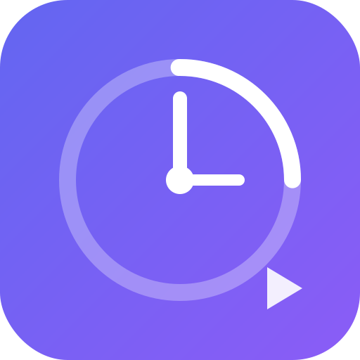

# TimeFlow Tracker

Um gerenciador de tempo pessoal PWA construído com Next.js 14, TypeScript e Tailwind CSS.



## 🚀 Funcionalidades

- **⏱️ Timer Ativo**: Cronômetro em tempo real com categorias personalizadas
- **📊 Dashboard Analítico**: Visualização de tempo gasto por categoria
- **🏷️ CRUD de Categorias**: Crie, edite e delete categorias de tempo
- **☁️ Sincronização Google Drive**: Seus dados ficam salvos no seu Google Drive
- **📱 PWA**: Instale no celular e use offline
- **🔐 Autenticação Google**: Login seguro com OAuth 2.0
- **📈 Gráficos Interativos**: Visualize seu uso do tempo com gráficos

## 🛠️ Stack Tecnológica

- **Framework**: Next.js 14 (App Router)
- **Linguagem**: TypeScript 5.x (strict mode)
- **Estilização**: Tailwind CSS + shadcn/ui
- **Autenticação**: NextAuth.js (Google Provider)
- **Armazenamento**: Google Drive API
- **Estado**: Zustand
- **Gráficos**: Recharts
- **Ícones**: Lucide React
- **Validação**: Zod
- **Testes**: Jest + React Testing Library + Cypress

## 📁 Estrutura do Projeto

```
TimeFlowTracker/
├── app/
│   ├── (auth)/
│   │   └── login/
│   │       └── page.tsx
│   ├── (dashboard)/
│   │   ├── layout.tsx
│   │   ├── page.tsx
│   │   ├── categories/
│   │   │   └── page.tsx
│   │   └── analytics/
│   │       └── page.tsx
│   ├── api/
│   │   ├── auth/
│   │   │   └── [...nextauth]/
│   │   ├── drive/
│   │   │   ├── sync/
│   │   │   └── backup/
│   │   └── timer/
│   ├── globals.css
│   ├── layout.tsx
│   └── providers.tsx
├── components/
│   ├── analytics/
│   ├── categories/
│   ├── layout/
│   ├── timer/
│   └── ui/
├── stores/
│   ├── categoryStore.ts
│   └── timerStore.ts
├── hooks/
│   ├── useLocalStorage.ts
│   ├── useDriveSync.ts
│   └── useTimer.ts
├── lib/
│   ├── auth.ts
│   ├── constants.ts
│   ├── drive.ts
│   ├── utils.ts
│   └── validations.ts
├── types/
│   ├── category.ts
│   ├── timer.ts
│   ├── user.ts
│   └── api.ts
├── __tests__/
│   └── components/
└── cypress/
    ├── e2e/
    └── support/
```

## 🚦 Começando

### Pré-requisitos

- Node.js 18.x ou superior
- npm ou yarn
- Conta Google (para configurar OAuth)

### Instalação

1. Clone o repositório:
```bash
git clone <repo-url>
cd TimeFlowTracker
```

2. Instale as dependências:
```bash
npm install
```

3. Configure as variáveis de ambiente:
```bash
cp .env.example .env.local
```

4. Preencha as variáveis no `.env.local`:
```env
NEXTAUTH_URL=http://localhost:3000
NEXTAUTH_SECRET=sua-chave-secreta-gerada

GOOGLE_CLIENT_ID=seu-client-id
GOOGLE_CLIENT_SECRET=seu-client-secret
```

### Configurando Google OAuth

1. Acesse o [Google Cloud Console](https://console.cloud.google.com/)
2. Crie um novo projeto ou selecione um existente
3. Vá em **APIs & Services > Credentials**
4. Clique em **Create Credentials > OAuth client ID**
5. Selecione **Web application**
6. Adicione em Authorized redirect URIs:
   - `http://localhost:3000/api/auth/callback/google`
7. Habilite a **Google Drive API** em APIs & Services > Library
8. Copie o Client ID e Client Secret para o `.env.local`

### Executando o Projeto

```bash
# Modo desenvolvimento
npm run dev

# Build para produção
npm run build

# Iniciar em produção
npm start
```

Acesse [http://localhost:3000](http://localhost:3000)

## 🧪 Testes

### Testes Unitários (Jest)

```bash
# Executar todos os testes
npm test

# Modo watch
npm run test:watch

# Com cobertura
npm run test:coverage
```

### Testes E2E (Cypress)

```bash
# Abrir Cypress UI
npm run cypress:open

# Executar em headless
npm run cypress:run
```

## 📱 PWA

O aplicativo pode ser instalado como PWA em dispositivos móveis e desktop:

1. Acesse o app no navegador
2. Clique no ícone de instalação na barra de endereços (ou menu do navegador)
3. Confirme a instalação

### Recursos PWA

- ✅ Funciona offline
- ✅ Ícone na tela inicial
- ✅ Splash screen
- ✅ Notificações (em desenvolvimento)

## 🎨 Personalização

### Tema

O tema é configurável via variáveis CSS em `app/globals.css`:

```css
:root {
  --primary: 238.7 83.5% 66.7%;
  --secondary: 240 4.8% 95.9%;
  /* ... */
}
```

### Categorias Padrão

Edite em `lib/constants.ts`:

```typescript
export const DEFAULT_CATEGORIES = [
  { name: 'Trabalho', color: '#6366f1' },
  { name: 'Estudos', color: '#22c55e' },
  // ...
];
```

## 📄 Scripts Disponíveis

| Script | Descrição |
|--------|-----------|
| `npm run dev` | Inicia servidor de desenvolvimento |
| `npm run build` | Build para produção |
| `npm start` | Inicia servidor de produção |
| `npm run lint` | Executa ESLint |
| `npm run format` | Formata código com Prettier |
| `npm test` | Executa testes unitários |
| `npm run test:watch` | Testes em modo watch |
| `npm run test:coverage` | Testes com cobertura |
| `npm run cypress:open` | Abre Cypress UI |
| `npm run cypress:run` | Executa Cypress headless |

## 🔒 Segurança

- Autenticação via OAuth 2.0 (NextAuth.js)
- Dados armazenados no Google Drive do usuário
- Sem banco de dados central - privacidade total
- HTTPS em produção

## 📝 Licença

MIT License - veja [LICENSE](LICENSE) para detalhes.

## 🤝 Contribuindo

1. Fork o projeto
2. Crie sua branch de feature (`git checkout -b feature/AmazingFeature`)
3. Commit suas mudanças (`git commit -m 'Add some AmazingFeature'`)
4. Push para a branch (`git push origin feature/AmazingFeature`)
5. Abra um Pull Request

## 📧 Contato

Se tiver dúvidas ou sugestões, abra uma issue no repositório.

---

Feito com ❤️ usando Next.js 14 e TypeScript
